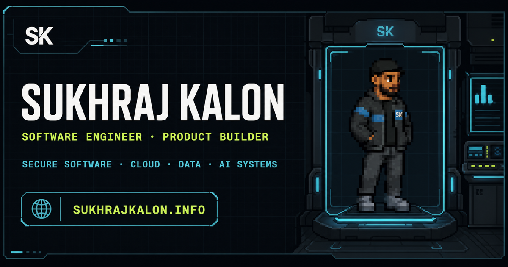

# SKPortfolio

[](https://sukhrajkalon.info)

An interactive software engineering portfolio built as a dark, five-chapter **Orbital Engineering Journey**. It combines an accessible, recruiter-friendly portfolio with an optional pixel-art **Chronicle Run** that turns the same professional timeline into a playable experience.

**[View the portfolio](https://sukhrajkalon.info)** · **[Play Chronicle Run](https://sukhrajkalon.info/game/)**

## Highlights

- Five responsive chapters covering profile, projects, experience, skills, and contact
- Server-rendered professional content that remains readable without JavaScript
- Original pixel-art scenes, character motion, and authored project windows
- Optional Phaser auto-runner with keyboard and touch controls
- Reduced-motion, keyboard, 320px viewport, and 200% text-size support
- Static production export with canonical metadata, JSON-LD, sitemap, and a 1200×630 social card
- Automated release coverage across Chromium, Firefox, and WebKit

The game is an enhancement, not a content gate: all portfolio evidence is available directly on the main route.

## Technology

- [Next.js 16](https://nextjs.org/) App Router and React 19
- TypeScript and Tailwind CSS 4
- Phaser 3 for the lazy-loaded game runtime
- Radix UI dialog primitives
- Playwright browser testing
- Static HTML export hosted without a Node.js production server

## Run locally

Requires Node.js 20.9 or newer and npm. The repository's `.nvmrc` selects Node 20.

```bash
git clone https://github.com/Sukhraj1000/SKPortfolio.git
cd SKPortfolio
npm ci
npm run dev
```

Open [http://localhost:3000](http://localhost:3000).

To build and serve the production export locally:

```bash
npm run build
npm start
```

The static server runs at [http://127.0.0.1:4173](http://127.0.0.1:4173) by default.

## Project structure

```text
src/
├── app/                         Routes, metadata, and portfolio styling
├── components/
│   ├── game/                    Chronicle shell, scenes, and story records
│   └── pixel-quest/             Portfolio sections and motion
└── data/portfolio.ts            Canonical professional content

public/                          Artwork and static assets
scripts/                         Export, server, and release validators
tests/ui/                        Playwright browser contracts
docs/RELEASE_QA.md               Detailed release and manual QA checklist
```

Portfolio code does not import Phaser, game scenes, or world artwork. The game runtime and its larger assets load only after the visitor explicitly activates Game mode.

## Quality checks

Install the browser binaries once:

```bash
npm run qa:ui:install
```

Run the complete release gate:

```bash
npm run qa
```

This checks formatting, linting, strict TypeScript, unused code, asset boundaries, workflow configuration, the production export, dependency vulnerabilities, the static server, the complete Chromium suite, and focused Firefox/WebKit compatibility.

Useful focused commands:

```bash
npm run qa:source         # source, types, references, and workflows
npm run qa:static         # exported routes, metadata, assets, and budgets
npm run qa:ui:chromium    # complete portfolio and game browser suite
npm run qa:ui:compat      # focused Firefox and WebKit coverage
```

See [the release QA guide](docs/RELEASE_QA.md) for the automated contract and remaining real-device checks.

## Accessibility

The portfolio uses semantic headings and landmarks, native disclosure controls, visible focus states, keyboard navigation, live reduced-motion handling, no-JavaScript fallbacks, and responsive layouts from 320px. Chronicle Run adds labelled keyboard and touch controls, a focus-contained Story Log, pause-aware timing, and a direct route back to the portfolio.

Automated checks support—but do not replace—physical keyboard, touch-device, VoiceOver, and NVDA review.

## Deployment

`npm run build` writes the static site to `out/`. GitHub Actions validates pull requests and `main`; Netlify publishes the production site at [sukhrajkalon.info](https://sukhrajkalon.info).

The export includes canonical Open Graph and Twitter metadata, the dedicated social card shown above, Person/project JSON-LD, `robots.txt`, and `sitemap.xml`.

## License

Source code and original project artwork are available under the [MIT License](LICENSE). Third-party fonts, marks, and portfolio media retain the rights described in [Asset licensing and attribution](ASSET-LICENSES.md). The MIT License does not grant trademark or endorsement rights.
